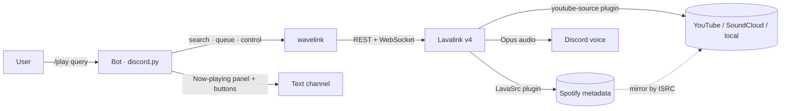
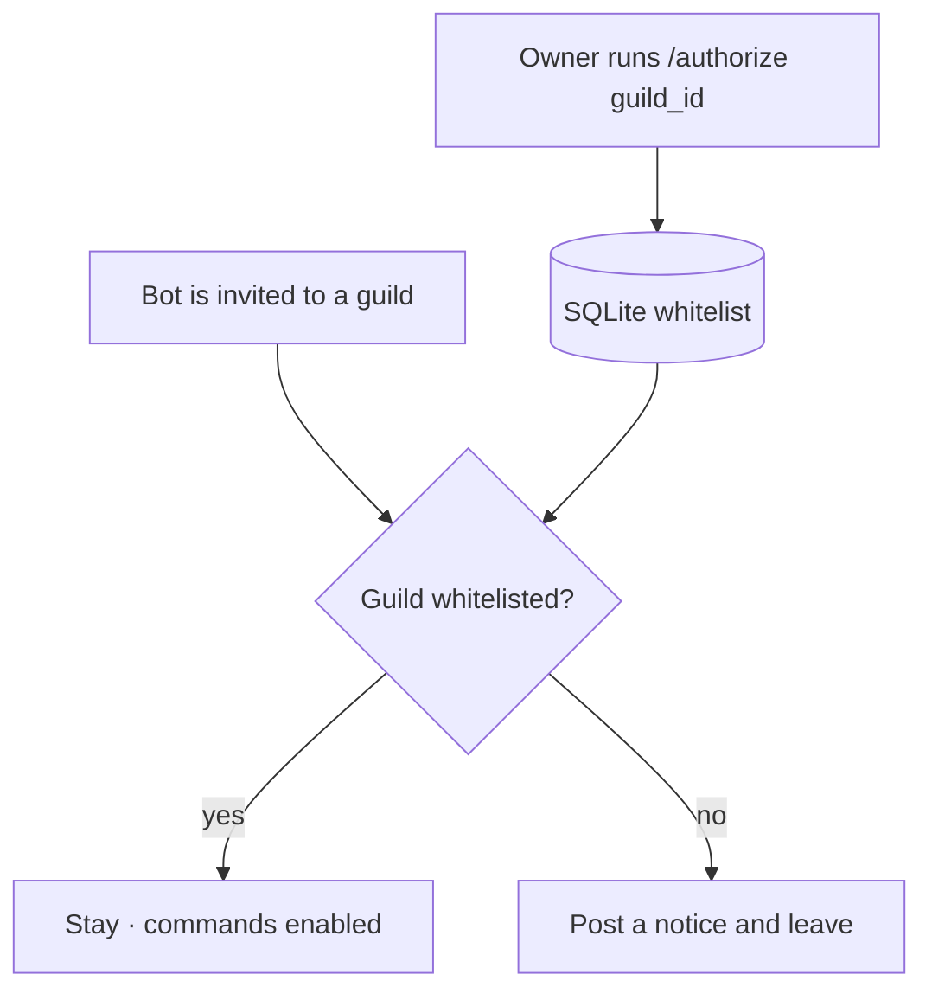

# Discord Music Bot

**A self-hosted, private Discord music bot — Lavalink-powered audio, per-guild
queues, interactive playback controls, an embed announcement builder, and a
guild whitelist so only servers *you* approve can use it.** Bring your own bot
token, run one `docker compose up`, and you have music in voice chat.


> A from-scratch rewrite of an earlier single-file `discord.py` + `yt-dlp` bot
> into a modular, cog-based architecture on **Lavalink v4 / wavelink** — with a
> SQLite-backed server whitelist, per-guild settings, and queue recovery after a
> restart.
> 🎥 **[Demo video](assets/demo.mp4)** · more shots below.

---

## What it is

The bot connects to a **Lavalink** node (a separate service in the same compose
stack) and streams audio into Discord voice channels. Every guild gets its own
player and queue — nothing is shared globally. Because the bot is **private**, it
only serves guilds explicitly added to a whitelist by the owner; it leaves any
server it is invited to otherwise.

## What it demonstrates

| Area | Concretely |
|---|---|
| **Modern discord.py** | Cogs + `setup_hook`, app (slash) commands, a global `tree.on_error`, typed `pydantic-settings` config |
| **Components V2 UI** | The whole interface is built from `LayoutView` / `Container` / `Section` — no embeds in the bot's own panels |
| **Real audio backend** | Lavalink v4 via **wavelink 3** — per-guild `Player`/`Queue`, search, playlists, seek, volume, loop modes, autoplay radio |
| **Spotify** | Track links and `spsearch:` via the **LavaSrc** plugin; audio is mirrored from YouTube by ISRC (albums/playlists are blocked by Spotify — see below) |
| **Per-guild state** | No globals — state lives on each guild's wavelink `Player`; settings, tickets, warnings & whitelist in SQLite (`aiosqlite`) |
| **Access control** | Private-bot guild whitelist, owner-only `/authorize`, DJ-role and command-channel gates, role-hierarchy guards on moderation |
| **Onboarding** | Persistent rules panel: one-click verification, support tickets in private channels with claim/close workflow |
| **Resilience** | Auto-leave on idle / empty channel, Lavalink reconnect with backoff, queue **restored after restart**, panels survive restarts |
| **Ops** | One `docker compose up` (bot + Lavalink), `.env`-driven config, non-blocking Discord log channel, 418-test pytest suite (403 offline + 15 end-to-end), ruff + mypy clean |

---

## Commands

**Music**

| Command | What it does |
|---|---|
| `/play <query>` | Play a track/playlist — YouTube, a **Spotify** track link, `spsearch:`, a direct link, or a local file |
| `/search <query>` | Search and pick a result from a menu |
| `/now` · `/queue` | Current track (with progress bar) / the queue |
| `/skip` · `/pause` · `/resume` · `/stop` | Playback control (DJ-gated) |
| `/seek <1:30>` · `/volume <0-200>` | Jump within the track / session volume (DJ-gated) |
| `/loop off\|track\|queue` | Repeat mode (DJ-gated) |
| `/remove <n>` · `/move <n> <to>` | Queue editing, with autocomplete (DJ-gated) |
| `/shuffle` · `/clear` | Shuffle / clear the queue (DJ-gated) |
| `/autoplay on\|off` | Radio mode — auto-play similar tracks when the queue ends |
| `/join` · `/jointo <ch>` · `/leave` | Voice channel management |

**Community**

| Command | What it does |
|---|---|
| `/ticket panel` | Post the rules panel: verify button, support tickets, help |
| `/ticket close` · `/ticket add <user>` | Close the current ticket / invite someone into it |
| `/ticket config …` | Category, support role, verify role, log channel, rules text |
| `/announce` · `/constructor` | Quick announcement / interactive post builder |
| `/help` | Interactive command list, generated from the live command tree |

**Moderation** (`/mod …`, needs the matching Discord permission)

| Command | What it does |
|---|---|
| `/mod warn` · `/mod warnings` · `/mod unwarn` · `/mod clearwarns` | Warning system, stored in SQLite |
| `/mod mute <10m>` · `/mod unmute` | Native Discord timeout |
| `/mod kick` · `/mod ban` · `/mod unban` | Membership actions |
| `/mod purge <n>` · `/mod slowmode <sec>` | Channel tools |
| `/mod log <channel>` | Where moderation actions are recorded |

**Administration**

| Command | What it does |
|---|---|
| `/settings show\|djrole\|channel\|volume` | Per-guild settings (Manage Server) |
| `/authorize` · `/deauthorize` · `/servers` | **Owner only** — manage the guild whitelist |

Every moderation command first checks role hierarchy — yours, the target's and
the bot's — so it refuses with a readable reason instead of a Discord error.

---

## How it works — audio pipeline



The bot never touches raw audio: wavelink forwards the voice connection to
Lavalink, and Lavalink resolves and streams the track. That removes the old
double-resolve step and keeps the bot process light.

**Spotify is metadata-only by design.** Spotify does not license third-party
audio playback, so LavaSrc resolves a link to its title/artist/ISRC and then
finds the same recording on YouTube. Matching on ISRC — the recording's unique
id — is what keeps it from picking a cover or a live version.

## How it works — private-bot authorization



Every guild command also passes a `guild_authorized` check, so even a race during
joining can't expose the bot on an unapproved server.

## Quick start

### 1. Discord Developer Portal

In the [Developer Portal](https://discord.com/developers/applications), on your
application:

- **Bot → Public Bot: off** (this is a private bot).
- **Bot → Privileged Gateway Intents:** enable **Message Content** and
  **Server Members**. Without them the bot exits at startup with
  `PrivilegedIntentsRequired`.
- Copy the bot **token** — you need it in the next step.

### 2. Configure and start

```bash
git clone https://github.com/ArseniAliakseichyk/Discord_bot.git
cd Discord_bot

cp .env.example .env         # fill in DISCORD_TOKEN and OWNER_IDS
mkdir -p data music          # see the note below — do this before the first run
docker compose up -d --build # starts Lavalink, waits for it, then starts the bot
```

> **Create `data/` and `music/` yourself.** The bot container runs as an
> unprivileged user (uid 1000). If Docker has to create these bind-mount
> directories it creates them owned by *root*, and the bot then dies with
> `sqlite3.OperationalError: unable to open database file`.
> If your own uid is not 1000, build with your ids instead:
> `docker compose build --build-arg UID=$(id -u) --build-arg GID=$(id -g)`

Check that it came up:

```bash
docker compose ps                 # both services should be "healthy"
docker compose logs -f bot
```

A healthy startup logs, in order: `Database connected`, `Lavalink node
registered`, `Loaded extension …` eight times, `Synced N application commands`,
and `✅ Bot <name> is ready`.

### 3. Whitelist your server — do this *before* inviting the bot

This is a private bot: it **leaves any guild that is not on the whitelist**, both
when it joins and on every startup. So authorizing after inviting does not work —
the bot is already gone by the time you can type a command.

1. Enable **Developer Mode** in Discord (User Settings → Advanced), right-click
   your server → **Copy Server ID**.
2. Authorize that ID, then invite the bot:
   - **DM the bot** `/authorize <guild_id>` (owner only), or
   - seed the database directly while the stack is stopped:
     ```bash
     docker compose stop bot
     sqlite3 data/bot.db \
       "INSERT OR IGNORE INTO authorized_guilds (guild_id, added_by, added_at)
        VALUES (<guild_id>, 0, strftime('%s','now'));"
     docker compose start bot
     ```
3. Now invite the bot to that server. It stays, and `/help` works.

Once the bot is in one authorized server, you can manage the rest from there with
`/authorize`, `/deauthorize` and `/servers`.

### 4. Optional: enable Spotify

Spotify links work through the [LavaSrc](https://github.com/topi314/LavaSrc)
Lavalink plugin, which needs its own API credentials:

1. Open the [Spotify developer dashboard](https://developer.spotify.com/dashboard)
   → **Create App**.
2. The form demands a **Redirect URI** — put anything valid (for example
   `http://127.0.0.1:8888/callback`). It is never used: LavaSrc authenticates
   with the client-credentials flow, which has no redirect step.
3. Copy the Client ID and secret into `.env`:
   ```
   SPOTIFY_CLIENT_ID=…
   SPOTIFY_CLIENT_SECRET=…
   ```
4. `docker compose up -d --force-recreate lavalink` — the credentials are read
   by the **Lavalink** container, not the bot.

Leave both empty to run without Spotify; `/play` then says so plainly instead of
reporting "nothing found" for a Spotify link.

**What actually works** — measured against the live Web API in August 2026, not
assumed:

| Spotify input | Works | Why |
|---|:--:|---|
| Track link (`/track/…`) | ✅ | `GET /v1/tracks/{id}` still serves client-credentials apps |
| `spsearch: query` | ✅ | `GET /v1/search` is unaffected |
| Album link (`/album/…`) | ❌ | LavaSrc reads albums via `GET /v1/tracks?ids=`, which Spotify **removed** in the [February 2026 migration](https://developer.spotify.com/documentation/web-api/references/changes/february-2026). May return once LavaSrc switches to `/v1/albums/{id}/tracks`, which still works |
| Playlist link (`/playlist/…`) | ❌ | `GET /v1/playlists/{id}/items` now answers `401 valid user authentication required` — it needs a logged-in user, which a bot does not have |
| Editorial playlists (`37i9dQZF1D…`) | ❌ | Spotify no longer exposes its own generated playlists to third-party apps at all |

These are Spotify-side restrictions on Development Mode apps, not bot bugs;
Extended Quota Mode (which lifts them) requires a company and 250k+ monthly
users. The bot detects album and playlist links up front and says so, rather
than letting the request fail as "nothing found". **YouTube playlists and albums
are unaffected** — use those for bulk queueing.

### 5. Optional: rules panel and tickets

The rules panel is what a new member sees: rules text, a verification button
that grants a role, a support-ticket button, and a help button. Tickets open as
private channels that staff claim and close.

```
/ticket config category      <категория для каналов тикетов>
/ticket config support-role  <роль поддержки>
/ticket config verify-role   <роль, выдаваемая по кнопке «Согласен»>
/ticket config log           <канал журнала>     # optional
/ticket config rules                             # opens a form to edit the text
/ticket panel                                    # publishes the panel
```

The bot needs **Manage Roles** (above the verify role) and **Manage Channels**
in the ticket category. `/ticket config show` reports what is still missing.

### Running without Docker

Needs Python 3.12 and a reachable Lavalink node. Point `LAVALINK_URI` at it
(e.g. `http://localhost:2333`) and use a virtual environment:

```bash
python3 -m venv venv
venv/bin/pip install -r requirements.txt
venv/bin/python bot.py
```

## Configuration (`.env`)

| Variable | Description |
|---|---|
| `DISCORD_TOKEN` | Bot token (required) |
| `OWNER_IDS` | Comma-separated owner IDs (fallback: application owner) |
| `LAVALINK_URI` / `LAVALINK_PASSWORD` | Lavalink node address & password |
| `SPOTIFY_CLIENT_ID` / `SPOTIFY_CLIENT_SECRET` | Optional — enables Spotify links and `spsearch:` |
| `LOG_CHANNEL_ID` | Channel for WARNING+ logs and image uploads (optional) |
| `ALLOWED_ROLES` / `DEFAULT_CHANNEL` | Roles allowed to announce / default announce channel |
| `DEFAULT_VOLUME` · `MAX_TRACK_LENGTH` · `MAX_PLAYLIST_TRACKS` · `INACTIVE_TIMEOUT` | Music tuning |
| `MUSIC_FOLDER` / `LAVALINK_LOCAL_DIR` | Local files path (bot side / Lavalink container side) |
| `DATABASE_PATH` | SQLite file path |

See [`.env.example`](.env.example) for the full, commented list.

## Repository layout

```
bot.py                 entry point (load config → run bot)
config.py              typed settings (pydantic-settings)
core/
  bot.py               MusicBot subclass: setup_hook, cog loading, error handler
  constants.py         shared limits, colours and repeated messages
  db.py                aiosqlite storage (whitelist, settings, sessions,
                       ticket config, tickets, warnings)
  lavalink.py          wavelink node connection (with retry)
cogs/                  one cog per command area — each is thin, the logic
  music.py             play/search/queue/seek/loop/volume + wavelink events
  voice.py             join / jointo / leave
  tickets.py           rules panel, verification, ticket workflow
  moderation.py        /mod warn|mute|kick|ban|purge|slowmode
  owner.py             authorize / deauthorize / servers
  guild_settings.py    /settings group (DJ role, channel, volume)
  admin.py             /announce (modal + preview)
  builder.py           /constructor — command only; the UI lives in ui/builder
  help.py              /help, generated from the live command tree
  events.py            logging + guild-whitelist enforcement
ui/
  v2.py                Components V2 toolkit (panels, budgets, embed→container)
  controls.py          now-playing panel + playback buttons
  search.py            search results select-menu
  tickets.py           rules panel, ticket modal, ticket controls
  builder/             the announcement builder, split by responsibility:
    state.py           the embed being edited + every mutation (no UI, testable)
    colors.py          presets, {color:…} markup, hex parsing
    modals.py          input forms
    fields.py          field pickers: edit, delete, reorder
    images.py          image by upload or by URL
    rows.py            the panel's button rows
    panel.py           the panel itself
utils/                 checks, formatting, mentions, moderation guards, logging
lavalink/              application.yml (youtube-source + LavaSrc plugins)
tests/                 pytest suite — 403 offline + 15 e2e
Dockerfile · docker-compose.yml
```

## Notes

- **YouTube playback needs the cipher service.** `youtube-source` no longer
  deciphers stream signatures itself, so the stack runs
  [yt-cipher](https://github.com/kikkia/yt-cipher) alongside Lavalink. Measured
  with the plugin's own `/youtube/stream/{id}` route: **500 without** the
  service, **200 with** it. Lavalink waits for it via `depends_on`, because it
  was possible for Lavalink to report healthy while the cipher container had
  not started, and every track then failed while the stack looked fine.
- **Some tracks still fail intermittently, and that is an upstream problem.**
  YouTube answers a share of requests with SABR-only data — audio formats
  listed but carrying no URL and no signature to decipher. Measured on one
  affected track, identical consecutive requests alternated between success and
  failure, succeeding about **1 time in 6**; a different track succeeded every
  time. Neither the pinned release, nor a `main` snapshot, nor the experimental
  `feat/sabr-support` branch changed this (2/12, 1/12 and failure respectively),
  so it is not a configuration mistake — see
  [youtube-source#240](https://github.com/lavalink-devs/youtube-source/issues/240).
  The bot retries a failed track up to three times before giving up, which is
  what turns most of those random refusals into playback.
- **If videos report `This video requires login`,** add an `oauth` block with a
  **burner** account, or a `pot` token — both are commented in
  `lavalink/application.yml`. A `poToken` only affects the `WEB` and
  `WEBEMBEDDED` clients and is not needed alongside OAuth.
- **If a plugin release stops working,** `YOUTUBE_PLUGIN_VERSION` /
  `YOUTUBE_PLUGIN_REPO` / `YOUTUBE_PLUGIN_SNAPSHOT` in `.env` switch to a
  snapshot build from `main` without editing any YAML.
- **Restart recovery** restores the *queue* (and rejoins the voice channel if real
  users are still there); it does not resume the exact in-track position.
- Run the tests with `pip install -r requirements-dev.txt && pytest` — 403 offline
  tests, no network or Discord token needed.
- **End-to-end checks** talk to a real Lavalink node and are excluded by default.
  They verify that both plugins loaded and that every source still resolves —
  including the Spotify limits documented above, so we find out if Spotify ever
  restores album and playlist access:
  ```bash
  docker compose up -d
  LAVALINK_URI=http://127.0.0.1:2333 LAVALINK_PASSWORD=<your password> \
      venv/bin/python -m pytest -m e2e
  ```
  They skip themselves when no node is reachable.

## License

[MIT](LICENSE).
