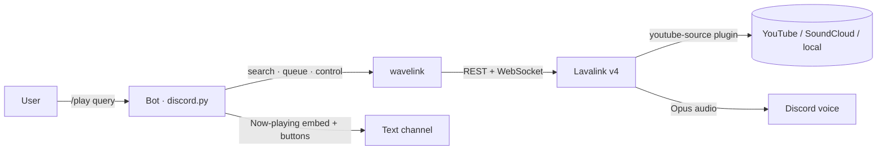
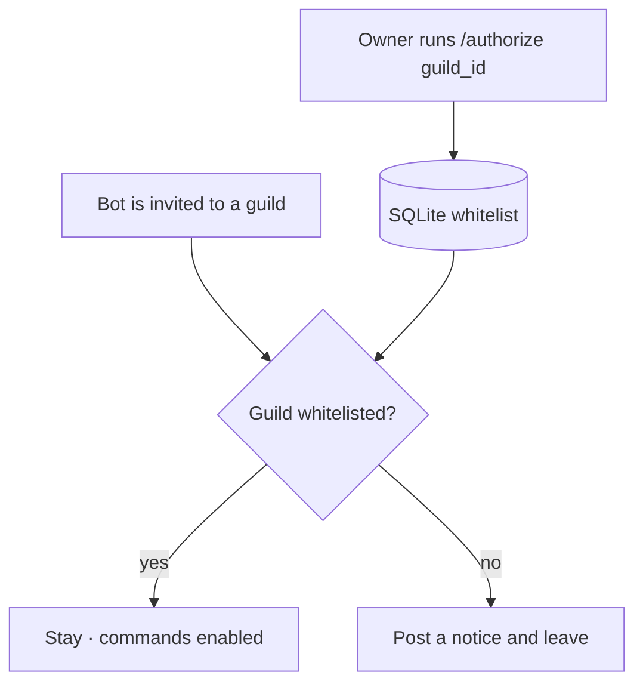

# Discord Music Bot

**A self-hosted, private Discord music bot — Lavalink-powered audio, per-guild
queues, interactive playback controls, an embed announcement builder, and a
guild whitelist so only servers *you* approve can use it.** Bring your own bot
token, run one `docker compose up`, and you have music in voice chat.


> A from-scratch rewrite of an earlier single-file `discord.py` + `yt-dlp` bot
> into a modular, cog-based architecture on **Lavalink v4 / wavelink** — with a
> SQLite-backed server whitelist, per-guild settings, and queue recovery after a
> restart.
> 🎥 **[Demo video](assets/demo.mp4)** · more shots below.

---

## What it is

The bot connects to a **Lavalink** node (a separate service in the same compose
stack) and streams audio into Discord voice channels. Every guild gets its own
player and queue — nothing is shared globally. Because the bot is **private**, it
only serves guilds explicitly added to a whitelist by the owner; it leaves any
server it is invited to otherwise.

## What it demonstrates

| Area | Concretely |
|---|---|
| **Modern discord.py** | Cogs + `setup_hook`, app (slash) commands, a global `tree.on_error`, typed `pydantic-settings` config |
| **Real audio backend** | Lavalink v4 via **wavelink 3** — per-guild `Player`/`Queue`, search, playlists, seek, volume, autoplay radio |
| **Per-guild state** | No globals — state lives on each guild's wavelink `Player`; settings & whitelist in SQLite (`aiosqlite`) |
| **Access control** | Private-bot guild whitelist, owner-only `/authorize`, DJ-role and command-channel gates |
| **Resilience** | Auto-leave on idle / empty channel, Lavalink reconnect with backoff, queue **restored after restart** |
| **Interactive UI** | Now-playing embed with control buttons, a search select-menu, a full embed **announcement builder** |
| **Ops** | One `docker compose up` (bot + Lavalink), `.env`-driven config, non-blocking Discord log channel, pytest suite |

---

## Commands

| Command | What it does |
|---|---|
| `/play <query>` | Play a track/playlist from a link, search query, or local file |
| `/search <query>` | Search and pick a result from a menu |
| `/now` · `/queue` | Show the current track / the queue |
| `/skip` · `/pause` · `/resume` · `/stop` | Playback control (DJ-gated) |
| `/shuffle` · `/clear` | Shuffle / clear the queue (DJ-gated) |
| `/autoplay on\|off` | Radio mode — auto-play similar tracks when the queue ends |
| `/join` · `/jointo <ch>` · `/leave` | Voice channel management |
| `/announce` · `/constructor` | Quick announcement / interactive embed builder |
| `/settings show\|djrole\|channel\|volume` | Per-guild settings (Manage Server) |
| `/authorize` · `/deauthorize` · `/servers` | **Owner only** — manage the guild whitelist |

---

## How it works — audio pipeline



The bot never touches raw audio: wavelink forwards the voice connection to
Lavalink, and Lavalink resolves and streams the track. That removes the old
double-resolve step and keeps the bot process light.

## How it works — private-bot authorization



Every guild command also passes a `guild_authorized` check, so even a race during
joining can't expose the bot on an unapproved server.

## Quick start

### 1. Discord Developer Portal

In the [Developer Portal](https://discord.com/developers/applications), on your
application:

- **Bot → Public Bot: off** (this is a private bot).
- **Bot → Privileged Gateway Intents:** enable **Message Content** and
  **Server Members**. Without them the bot exits at startup with
  `PrivilegedIntentsRequired`.
- Copy the bot **token** — you need it in the next step.

### 2. Configure and start

```bash
git clone https://github.com/ArseniAliakseichyk/Discord_bot.git
cd Discord_bot

cp .env.example .env         # fill in DISCORD_TOKEN and OWNER_IDS
mkdir -p data music          # see the note below — do this before the first run
docker compose up -d --build # starts Lavalink, waits for it, then starts the bot
```

> **Create `data/` and `music/` yourself.** The bot container runs as an
> unprivileged user (uid 1000). If Docker has to create these bind-mount
> directories it creates them owned by *root*, and the bot then dies with
> `sqlite3.OperationalError: unable to open database file`.
> If your own uid is not 1000, build with your ids instead:
> `docker compose build --build-arg UID=$(id -u) --build-arg GID=$(id -g)`

Check that it came up:

```bash
docker compose ps                 # both services should be "healthy"
docker compose logs -f bot
```

A healthy startup logs, in order: `Database connected`, `Lavalink node
registered`, `Loaded extension …` eight times, `Synced N application commands`,
and `✅ Bot <name> is ready`.

### 3. Whitelist your server — do this *before* inviting the bot

This is a private bot: it **leaves any guild that is not on the whitelist**, both
when it joins and on every startup. So authorizing after inviting does not work —
the bot is already gone by the time you can type a command.

1. Enable **Developer Mode** in Discord (User Settings → Advanced), right-click
   your server → **Copy Server ID**.
2. Authorize that ID, then invite the bot:
   - **DM the bot** `/authorize <guild_id>` (owner only), or
   - seed the database directly while the stack is stopped:
     ```bash
     docker compose stop bot
     sqlite3 data/bot.db \
       "INSERT OR IGNORE INTO authorized_guilds (guild_id, added_by, added_at)
        VALUES (<guild_id>, 0, strftime('%s','now'));"
     docker compose start bot
     ```
3. Now invite the bot to that server. It stays, and `/help` works.

Once the bot is in one authorized server, you can manage the rest from there with
`/authorize`, `/deauthorize` and `/servers`.

### Running without Docker

Needs Python 3.12 and a reachable Lavalink node. Point `LAVALINK_URI` at it
(e.g. `http://localhost:2333`) and use a virtual environment:

```bash
python3 -m venv venv
venv/bin/pip install -r requirements.txt
venv/bin/python bot.py
```

## Configuration (`.env`)

| Variable | Description |
|---|---|
| `DISCORD_TOKEN` | Bot token (required) |
| `OWNER_IDS` | Comma-separated owner IDs (fallback: application owner) |
| `LAVALINK_URI` / `LAVALINK_PASSWORD` | Lavalink node address & password |
| `LOG_CHANNEL_ID` | Channel for WARNING+ logs and image uploads (optional) |
| `ALLOWED_ROLES` / `DEFAULT_CHANNEL` | Roles allowed to announce / default announce channel |
| `DEFAULT_VOLUME` · `MAX_TRACK_LENGTH` · `MAX_PLAYLIST_TRACKS` · `INACTIVE_TIMEOUT` | Music tuning |
| `MUSIC_FOLDER` / `LAVALINK_LOCAL_DIR` | Local files path (bot side / Lavalink container side) |
| `DATABASE_PATH` | SQLite file path |

See [`.env.example`](.env.example) for the full, commented list.

## Repository layout

```
bot.py                 entry point (load config → run bot)
config.py              typed settings (pydantic-settings)
core/
  bot.py               MusicBot subclass: setup_hook, cog loading, error handler
  db.py                aiosqlite storage (whitelist, settings, saved sessions)
  lavalink.py          wavelink node connection (with retry)
cogs/
  music.py             play/search/queue/controls + wavelink events
  voice.py             join / jointo / leave
  owner.py             authorize / deauthorize / servers
  guild_settings.py    /settings group (DJ role, channel, volume)
  admin.py             /announce (modal + preview)
  builder.py           /constructor (interactive embed builder)
  help.py              /help
  events.py            logging + guild-whitelist enforcement
ui/
  controls.py          now-playing embed + control buttons
  search.py            search results select-menu
utils/                 checks, formatting, validation, logging
lavalink/              application.yml (youtube-source plugin)
tests/                 pytest suite (formatting, validation, checks, db)
Dockerfile · docker-compose.yml
```

## Notes

- **YouTube in 2026:** playback uses the `youtube-source` Lavalink plugin. From a
  datacenter IP, YouTube may require OAuth/PO-token or cookies — configure these
  in `lavalink/application.yml` if you hit playback errors.
- **Restart recovery** restores the *queue* (and rejoins the voice channel if real
  users are still there); it does not resume the exact in-track position.
- Run the tests with `pip install -r requirements-dev.txt && pytest`.

## License

[MIT](LICENSE).
